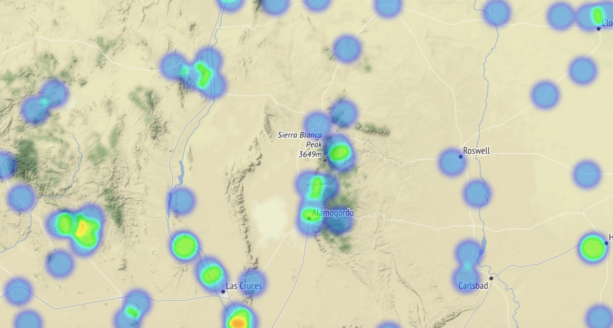

# Using Text to Catalog UFO Sightings
July, 2018

Tim Marlowe, Whitney Meer, Jim McGugan

_This case study was completed in a single day - we feel confident that further time for data analysis would result in a much deeper analysis._

### The Data

We used data collected from [The National UFO Reporting Center Online Database](http://www.nuforc.org/webreports.html). The data is downloadable as a zipped `json` file [here](https://s3.amazonaws.com/ufodatafordarren/ufodata.json.zip).


### Cleaning The File
We used the BeautifulSoup library to parse and clean the data. This undoubtedly took most of our time. Here's our cleaning pipeline:
```python
import json
#Accessing text and creating list of lists with beautiful soup
soup_list2 = []
for idx in range(len(reports)):
    try:
        soup = BeautifulSoup(reports[idx]['html'], 'html.parser')
        #soup.tbody.stripped_strings returns a generator,
        #so we build a list comprehension to get the lines
        #of text out of the generator object.
        lst = [text for text in soup.tbody.stripped_strings]
        soup_list2.append(lst)
    except AttributeError:
        continue

#Joining 'Description' text from end of file
for lst in soup_list2:
    #The lists were different lengths, since soup.tbody.stripped_strings was splitting on line breaks -- some of these descriptions are quite long! We noticed that the first 6 lines were always the same, so we joined the remaining items in the list as our "description" feature.
    joined = ' '.join(lst[6:])
    lst.insert(6,joined)

#Writing out to csv
with open("../output.csv", "wb") as f:
    writer = csv.writer(f)
    for row in soup_list2:
        row = row[:7]
        row=[s.encode('utf-8') for s in row]
        writer.writerows([row])

#Reloading as pd dataframe
ufo = pd.read_csv('../data/output.csv', header=None)
ufo.rename({0:'Occurred',1:'Reported',2:'Posted',3:'Location',4:'Shape',5:'Duration',6:'Description'},axis=1,inplace=True)
ufo.to_pickle('../data/ufo_db.pkl')
```

### EDA
Number of UFO Sightings Per State


What Shape Are UFOs?

Fireball!

When Are UFO Sightings Happening?


Which Years Were UFOs Spotted?


### Mapping UFO Sightings
Using a library converting place names to latitude and longitude, we found the geolocations of 100,144 of the 136,322 UFO sightings in the data. Here is the link to the [heatmap](images/ufo_sightings_heat_map.html) of those sightings. You can download and zoom in for more detail.  

The map of the entire country is not that informative:


However, upon zooming in, we note some interesting findings. While UFO sightings appear to be more common in suburban areas than rural areas (probably just a function of population), they seem to be fairly uncommon within this largest cities. The maps of the New York area and the Bay Area below demonstrate this:

__New York Area__


__Bay Area__


We believe this is likely because the night sky in large cities is so obscured that there is not much opportunity for sighting anything.

Finally, we took a look at a few places that had [famous UFO sightings](https://www.history.com/news/historys-most-infamous-ufo-sightings) prior to the period in which the data was collected:

__Roswell, NM__


In spite of Roswell's famous history for its 1947 siting, it does not appear frequently in our data. In fact, a much more frequent location for siting UFOS was the Sierra Blance mountain range to the west of the town.

__Mt. Rainier, WA__


There do appear to be some hotspots of UFO sighting around Mt. Rainier, especially to the north and northeast. It's unclear if they are related in any way to the history of UFO sighting after the 1947 Kenneth Arnold sighting.

__Northern Texas__


There are a few UFO sightings in Lubbock and Levelland, TX, but actually probably less than would be expected for an area with the population of Lubbock.

From our short, anecdotal analysis, location of current sightings of UFOs doesn't seem to have a connection with famous UFO events.


### NMF Topics
Each UFO sighting comes with a description, so we made a TF-IDF matrix with each sighting description as a document. From there, we used NMF to find the words that loaded heavily on hidden topics.

|          | Word 1      | Word 2      | Word 3    | Word 4   | Word 5   |
|:---------|:------------|:------------|:----------|:---------|:---------|
| Topic 1  | went        | looked      | like      | just     | saw      |
| Topic 2  | approximate | pd          | note      | nuforc   | date     |
| Topic 3  | orbs        | disappeared | fireball  | glowing  | orange   |
| Topic 4  | remain      | information | anonymous | elects   | provides |
| Topic 5  | formation   | flashing    | triangle  | red      | lights   |
| Topic 6  | south       | west        | north     | east     | objects  |
| Topic 7  | green       | red         | white     | bright   | light    |
| Topic 8  | white       | shape       | appeared  | shaped   | object   |
| Topic 9  | triangular  | flying      | triangle  | shaped   | craft    |
| Topic 10 | stars       | like        | moving    | sky      | star     |

Interesting next steps on this front would be to analyze whether some of these categories of sighting report language are more or less likely to occur in different geographical areas.

### Further Work
- Segment UFO sightings by location, time, etc. to find patterns in each segment.
- Sometimes, the NUFORC moderators make notes in descriptions - we'd like to analyze which sightings have a clear explanation vs. which ones don't. Are there certain shapes, times of day or month, or other factors related to better- or worse-explained sightings?


.
